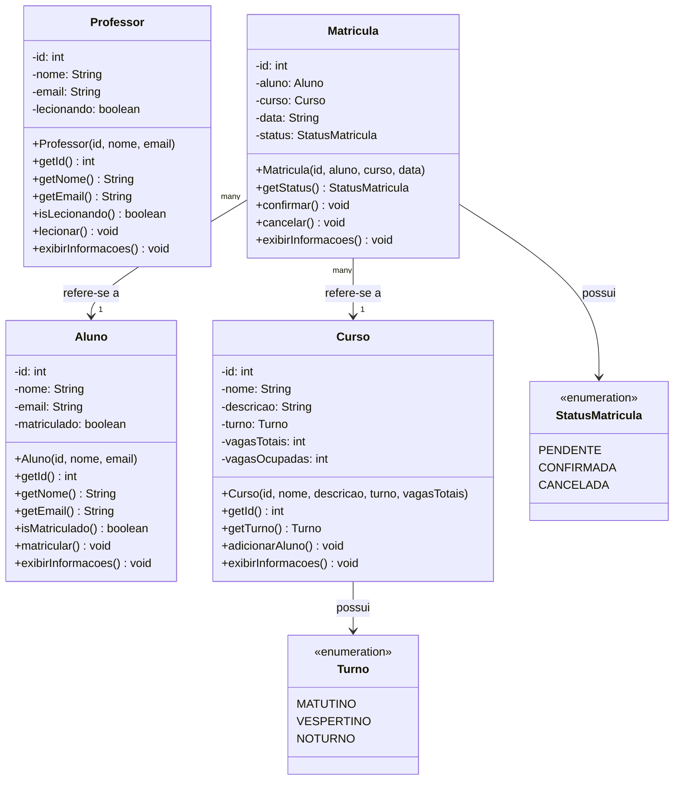

# 🎓 EduControl — Sistema de Cursos e Matrículas

## 📌 Sobre o projeto

O **EduControl** é um sistema desenvolvido em **Java** com o objetivo de representar o gerenciamento de uma instituição de ensino.

O sistema permite representar informações sobre **alunos, professores, cursos e matrículas**, aplicando conceitos de **Programação Orientada a Objetos (POO)**.

---

## 🎯 Objetivo

O objetivo do projeto é desenvolver uma aplicação simples que represente o funcionamento de uma instituição de ensino, utilizando **classes, atributos, métodos e objetos**.

---

## 👥 Entidades do sistema

| Classe | Descrição |
|---|---|
| 👨‍🎓 `Aluno` | Representa os estudantes |
| 👨‍🏫 `Professor` | Representa os professores |
| 📚 `Curso` | Representa os cursos oferecidos |
| 📝 `Matricula` | Representa a matrícula de um aluno em um curso |
| ▶️ `Main` | Executa e demonstra o funcionamento do sistema |

---

## 💻 Tecnologias utilizadas

- ☕ **Java**
- 💻 **Visual Studio Code**
- 🐙 **GitHub**

---
# Diagrama atulizado:  



## 📂 Estrutura do projeto

```text
poo-edu-control/
│
├── Main.java
├── Aluno.java
├── Professor.java
├── Curso.java
├── Matricula.java
├── README.md
│
└── img/
    ├── imagem1.png
    └── imagem2.png


